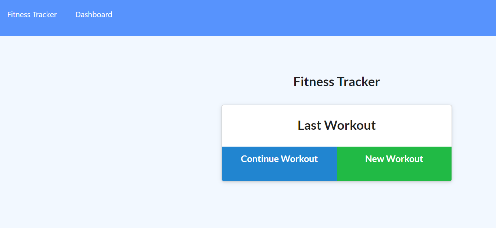
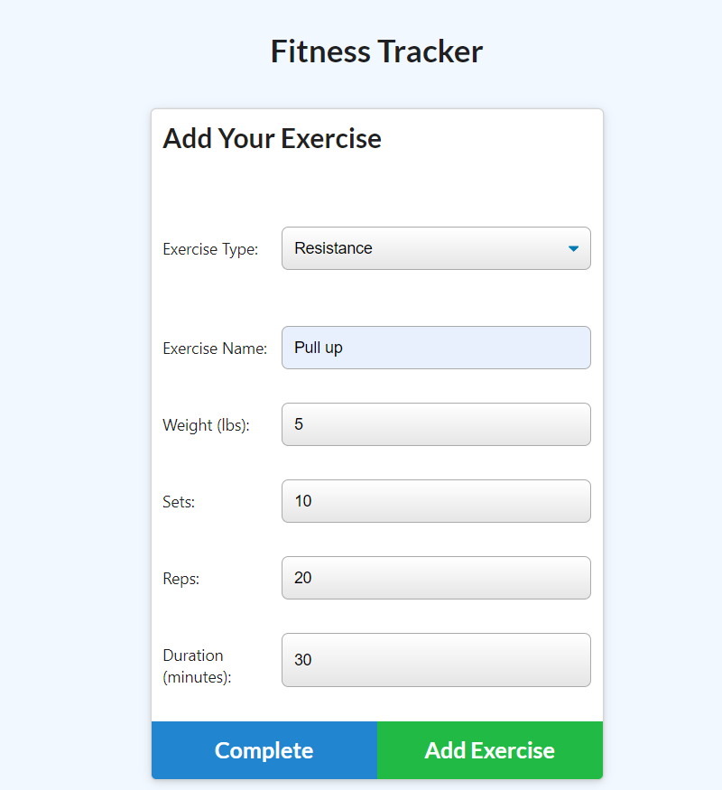
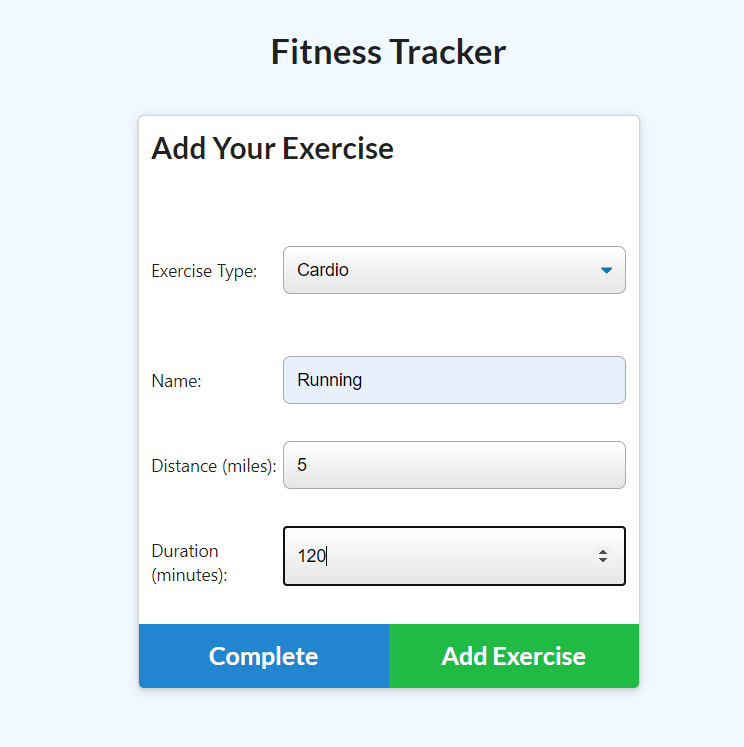

# Workout-Tracker

  
#### Table of Contents
* [Project Description](#project-description)
* [Installation Instructions](#installation-instructions)
* [Usage Information](#usage-information)
* [Contributor Guidelines](#contributor-guidelines)
* [Code of Conduct](#code-of-conduct)
* [Test Instructions](#test-instructions)
* [License](#license)
* [App Link](#app-link)
* [Questions](#questions)
* [Deployment Image](#deployment-image)

## Project Description
* This project is a workout tracker running off a Mongodb database. With this app users will be able to view create and track daily workouts. The user will be able to log multiple exercises in a workout on a given day. The user will be able to track the name, type, weight, sets, reps, and duration of exercise. If the exercise is a cardio exercise, I should be able to track my distance traveled.

## Installation Instructions
* Express
* Mongodb
* Mongoose
* Morgan

## Usage Information
* You need to install the packages above to be able to run this code.

## Contributor Guidelines
* Contribution rules are under the Code of Conduct section

## Code of Conduct
* [Contributor Code of Conduct](https://www.contributor-covenant.org/version/2/0/code_of_conduct/code_of_conduct.md)

## Test Instructions
* No test required

## License
* MIT License

## App Link
* [Workout Tracker](https://timetogetfit.herokuapp.com/)

## Questions
* For additional help or questions about collaboration, please reach out to jpodell21@gmail.com
* Follow me on Github at 
* [JamesO1231](http://github.com/JamesO1231)

## Deployment Image

